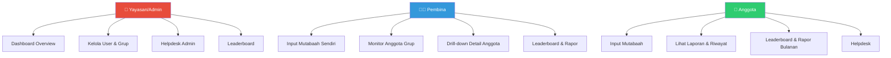

<div align="center">

<!-- Animated Header -->


<br/>

[](https://react.dev)
[](https://vite.dev)
[](https://developers.google.com/apps-script)
[](https://vercel.com)
[]()

<br/>


</div>

---

## 📌 Tentang Proyek

**Mutabaah Yaumiyah** adalah web app pencatatan & evaluasi amalan ibadah pekanan untuk guru di **SIT Matahari**. Sistem ini membantu pembina dan yayasan memantau konsistensi ibadah anggota melalui dashboard interaktif, leaderboard, dan rapor bulanan.

### Mengapa Mutabaah Yaumiyah?

```
📱 Anggota mencatat amalan ibadah mingguan mereka
         ↓
📊 Sistem menghitung persentase pencapaian per amalan
         ↓
👥 Pembina memantau progress anggota grup
         ↓
🏆 Leaderboard mendorong konsistensi melalui streak
         ↓
📄 Rapor bulanan merangkum evaluasi per periode
         ↓
🏫 Yayasan memonitor seluruh sekolah dari satu dashboard
```

---

## ✨ Fitur Utama

<div align="center">

| 🕌 Pencatatan Amalan | 📊 Dashboard & Laporan | 🏆 Gamifikasi |
|:---|:---|:---|
| Sholat Fardu (5 waktu × 7 hari) | Dashboard personal per role | Leaderboard streak & skor |
| Shalat Berjamaah (grid) | Riwayat collapsed + expandable | Streak konsistensi pekanan |
| Sholat Dhuha, Tilawah, Matsurat | Rapor Bulanan (cetak/PDF) | Predikat A–E |
| Puasa Sunnah, Qiyamullail | Drill-down anggota (pembina) | Badge pencapaian |

| 👤 Multi-Role | 🎫 Helpdesk | 🔒 Keamanan |
|:---|:---|:---|
| Anggota — isi & lihat rapor | Ticketing system lengkap | Google OAuth login |
| Pembina — monitor grup | Status: Open → In Progress → Resolved | Permission check per endpoint |
| Yayasan/Admin — kelola semua | Komentar & update real-time | Audit trail edit (C3) |

</div>

---

## 🛠️ Tech Stack

| Layer | Teknologi | Keterangan |
|:------|:----------|:-----------|
| **Frontend** | React 19 + Vite 8 | SPA dengan React Router v7 |
| **Styling** | Vanilla CSS | Design system custom, responsive |
| **Icons** | Lucide React | 250+ icons |
| **Backend** | Google Apps Script | REST API via `doGet`/`doPost` |
| **Database** | Google Sheets | Multi-sheet (users, groups, mutabaah_YYYY, dll) |
| **Auth** | Google OAuth 2.0 | Sign in with Google |
| **Hosting** | Vercel | Auto-deploy dari GitHub |
| **Cache** | IndexedDB + GAS CacheService | Stale-while-revalidate pattern |

---

## 📁 Struktur Proyek

```
mutabaah-yaumiyah/
├── app/                          # Frontend (React + Vite)
│   ├── public/
│   │   └── SIT_MATAHARI_LOGO.png
│   ├── src/
│   │   ├── components/           # Layout, Sidebar, Bottom Nav
│   │   ├── config/               # Constants, amalan targets
│   │   ├── context/              # AuthContext, MutabaahContext
│   │   ├── pages/                # 15+ halaman (Dashboard, Input, dll)
│   │   ├── services/             # API client (IndexedDB cache + retry)
│   │   ├── App.jsx               # Router utama
│   │   ├── main.jsx              # Entry point
│   │   └── index.css             # Design system global
│   ├── .env.example              # Template environment variables
│   ├── package.json
│   └── vite.config.js
│
├── gas/                          # Backend (Google Apps Script)
│   ├── Code.gs                   # Router (doGet/doPost) + setup
│   ├── Auth.gs                   # Login & Google OAuth
│   ├── Users.gs                  # User CRUD + Leaderboard + Drill-down
│   ├── Mutabaah.gs               # Submit, History, Streak, Reset
│   ├── RaporBulanan.gs           # Monthly report generation
│   ├── Helpdesk.gs               # Ticketing system
│   ├── Admin.gs                  # Admin/Yayasan operations
│   └── Utils.gs                  # Helpers (week calc, hash, cache)
│
├── docs/                         # Dokumentasi
│   ├── PRD-Mutabaah-Yaumiyah.md
│   └── PRD-Addendum-v1.2.md
│
├── vercel.json                   # Vercel deployment config
├── .gitignore
└── README.md                     # File ini
```

---

## ⚙️ Cara Menjalankan

### 1. Clone Repository

```bash
git clone https://github.com/<username>/mutabaah-yaumiyah.git
cd mutabaah-yaumiyah
```

### 2. Setup Frontend

```bash
cd app
npm install
cp .env.example .env
# Edit .env — isi VITE_GAS_URL dan VITE_GOOGLE_CLIENT_ID
```

### 3. Jalankan Development Server

```bash
npm run dev
# Buka http://localhost:5173
```

### 4. Setup Backend (Google Apps Script)

1. Buka [Google Apps Script](https://script.google.com) → buat project baru
2. Copy semua file dari folder `gas/` ke project GAS
3. Jalankan `setupDatabase()` untuk inisialisasi sheet
4. Jalankan `setupAdmin()` untuk membuat akun admin pertama
5. Deploy > New deployment > **Web App** (Execute as: Me, Access: Anyone)
6. Copy URL deployment → paste ke `VITE_GAS_URL` di `.env`

### 5. Setup Google OAuth

1. Buka [Google Cloud Console](https://console.cloud.google.com/apis/credentials)
2. Buat **OAuth Client ID** (Web application)
3. Tambahkan Authorized JavaScript Origins:
   - `http://localhost:5173` (development)
   - `https://your-domain.vercel.app` (production)
4. Copy Client ID → paste ke `VITE_GOOGLE_CLIENT_ID` di `.env`

---

## 🚀 Deploy ke Vercel

### Opsi A — Deploy via GitHub (Recommended)

```bash
# 1. Init & push ke GitHub
git init
git add .
git commit -m "Initial commit: Mutabaah Yaumiyah v1.0"
git branch -M main
git remote add origin https://github.com/<username>/mutabaah-yaumiyah.git
git push -u origin main

# 2. Di Vercel:
#    - Import repository dari GitHub
#    - Framework: Vite (auto-detected via vercel.json)
#    - Environment Variables:
#      VITE_GAS_URL = <URL GAS Web App>
#      VITE_GOOGLE_CLIENT_ID = <OAuth Client ID>
#    - Deploy!
```

### Opsi B — Deploy Manual (Vercel CLI)

```bash
npm install -g vercel
cd mutabaah-yaumiyah
vercel --prod
# Ikuti prompt, set environment variables saat ditanya
```

> ⚠️ **Penting:** Setelah deploy ke Vercel, tambahkan domain Vercel (`https://xxx.vercel.app`) ke **Authorized JavaScript Origins** di Google Cloud Console agar Google OAuth berfungsi.

---

## 📊 Skema Database (Google Sheets)

| Sheet | Fungsi | Kolom Utama |
|:------|:-------|:------------|
| `users` | Data pengguna | user_id, email, nama, role, grup_id, streak_current |
| `groups` | Data grup pembinaan | grup_id, nama_grup, pembina_user_id |
| `mutabaah_YYYY` | Catatan amalan per pekan | 70+ kolom (grid sholat) + 8 kolom persen + audit trail |
| `rekap_mingguan` | Agregat per grup per pekan | grup_id, pekan, total anggota, rata-rata |
| `rapor_bulanan` | Cache rapor bulanan | user_id, bulan, tahun, rata_rata, predikat |
| `helpdesk_tickets` | Tiket bantuan | ticket_id, subject, status, priority |
| `helpdesk_comments` | Komentar tiket | comment_id, ticket_id, message |

---

## 🔐 Role & Akses



---

## 📋 API Endpoints

<details>
<summary><b>GET Endpoints</b></summary>

| Action | Parameter | Deskripsi |
|:-------|:----------|:----------|
| `login` | email | Login via Google email |
| `getUser` | userId | Get user profile |
| `getCurrentWeek` | userId, tahun, pekan | Data mutabaah pekan ini |
| `getHistory` | userId, tahun, limit, offset | Riwayat mutabaah |
| `getDashboard` | userId | Dashboard data |
| `getGrupAnggota` | grupId | List anggota grup |
| `getGrupRekap` | grupId, tahun, pekan | Rekap grup |
| `getMemberMutabaah` | pembinaUserId, memberUserId, tahun | Drill-down anggota |
| `getLeaderboard` | mode (streak/score) | Papan peringkat |
| `getMonthlyReport` | userId, bulan, tahun | Rapor bulanan |
| `getMyTickets` | userId | Tiket helpdesk saya |
| `getAllTickets` | status | Semua tiket (admin) |

</details>

<details>
<summary><b>POST Endpoints</b></summary>

| Action | Body | Deskripsi |
|:-------|:-----|:----------|
| `submitMutabaah` | weekData, userId, pekan, tahun | Simpan mutabaah |
| `resetWeek` | userId, tahun, pekan | Hapus data pekan |
| `register` | email, nama, pembina | Registrasi anggota baru |
| `createTicket` | subject, message, priority | Buat tiket helpdesk |
| `addComment` | ticketId, message | Tambah komentar |
| `updateTicketStatus` | ticketId, status | Update status tiket |

</details>

---

## 📝 Changelog

### v1.0 (4 Agustus 2026)

**Bug Fixes:**
- 🔧 **B1+B2:** Form reset otomatis saat pekan berganti (week-bound localStorage + auto-detect)
- 🔧 **B3:** Hapus pekan langsung tereflek di UI + modal konfirmasi custom
- 🔧 **B4:** Laporan/riwayat kini collapsed by default + paginasi "Muat lebih"
- 🔧 **B5:** Streak dihitung dari minggu berturut-turut yang benar-benar submit
- 🔧 **B6:** Pembina bisa drill-down ke detail mutabaah anggota (permission-checked)

**Fitur Baru:**
- 🏆 **C1:** Leaderboard dual-mode (streak konsistensi & skor pekan)
- 📄 **C2:** Rapor Bulanan (printable/PDF) dengan predikat A–E
- 🔍 **C3:** Audit trail edit — catat `edit_count` & `last_edited_at` per record
- 🎫 Helpdesk ticketing system
- 🔐 Google OAuth sign-in & sign-up flow

---

## 📚 Referensi

- [React 19 Documentation](https://react.dev)
- [Vite — Next Generation Frontend Tooling](https://vite.dev)
- [Google Apps Script Reference](https://developers.google.com/apps-script)
- [Lucide Icons](https://lucide.dev)
- [Vercel Deployment Docs](https://vercel.com/docs)

---

<div align="center">


<br/>

**SIT Matahari — Mutabaah Yaumiyah** · Internal Tools

<br/>

[](https://github.com)

</div>
